<<<<<<< HEAD:DH-Project3_final.Rmd
---
title: "Project 3 Group 4"
author: " Amola Mehta, Anjali Sajith, Auntora Mitra, Pulari Baskar"
output:
  html_document:
    font_size: 14
    toc: TRUE
    toc_float: TRUE
    toc_depth: 6
    margin-left: auto;
    margin-right: auto;
---


```{r setup, include=FALSE}
knitr::opts_chunk$set(echo = TRUE, message = FALSE)
```


# Complicating Communalism

*Analyzing Instances and Effects of Religious Conflicts in Manto’s “Mottled Dawn” and Sarna’s “Savage Harvest”*

# Introduction and Research Questions

For our project, we decided to perform an analysis of the religious conflicts that take place in Saadat Hasan Manto’s collection of short stories on partition, Mottled Dawn. We procured our data from the collaborative Heurist database the class created for this project. Our group contributed a total of 168 entries to the database. The break-up of the number of entries by each group member is as follows:

Amola Mehta : n=29
Anjali Sajith : n=20
Auntora Mitra : n=78 
Pulari Baskar : n=41

The specific questions we used to frame our research were: 
What are the different effects of the religious conflicts we see recorded in Manto’s, Mottled Dawn and Sarna’s Savage Harvest ? How do instances of religious conflict manifest across the collection? How do these lines of inquiry complicate our understanding of partition via its fictionalization? 

# Research Queries 

In order to help arrive at answers to our research questions, we operationalized five potential lines of inquiry into the following queries:

How many deaths have occurred in religious conflicts? (Filters: Characters in Events, Religious Conflict, Variable 1 = Vitality)

What is the difference in the number of men and women killed in religious conflicts? Does gender based-conflict occur outside of religion? (Filters: Characters in Events, Religious Conflict, Variable 1 = Vitality, Variable 2 = Gender)

Where does most of the religious conflict take place? What is the religious background of the location?  (Filters: Events, Religious Conflict,  Variable 1 = Location of Event)

How do instances of religious conflict occur in the collection? Are they narrated in the present or are they remembered in the past? (Filters: Events, Variable 1 = Narrative Status, Variable 2 = Conflict)

How many events talk about groups of people inflicting violence upon another? (Filters: Character, Variable 1 = Number, Variable 2 = Religion)

# Crosstabs

Using the Crosstabs function provided by Heurist, we generated the following tables as CSV files:

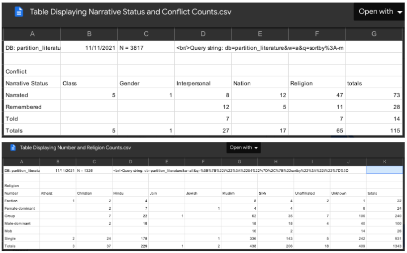
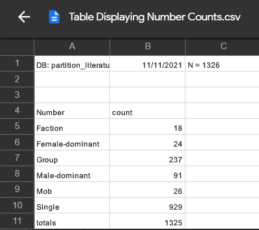
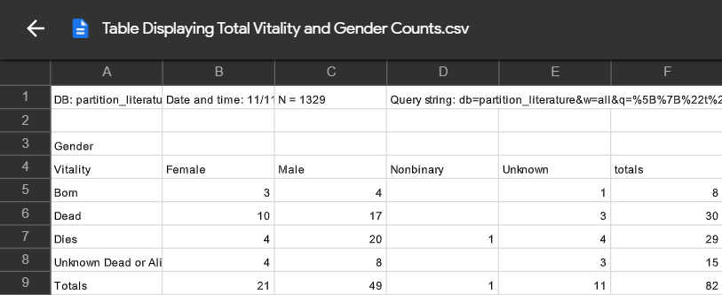
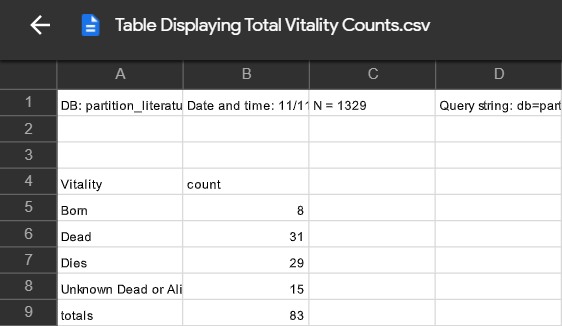
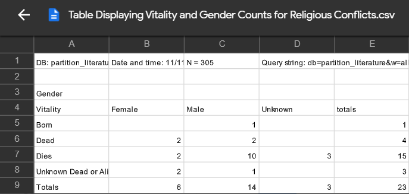
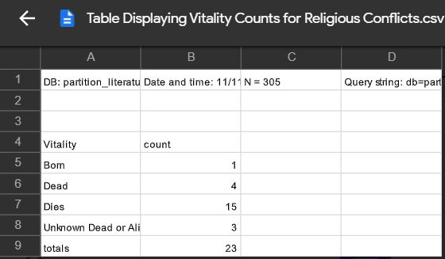
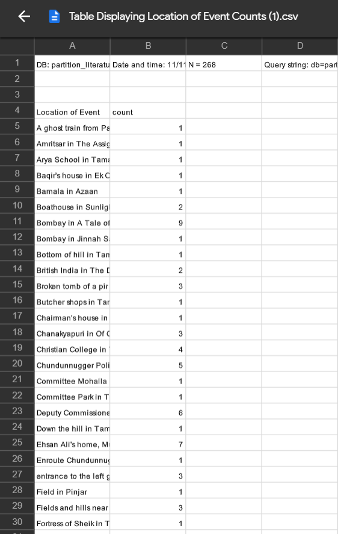

# Analysis

## Deaths in Religious Conflicts

Considering that Mottled Dawn and Savage Harvest are collections of stories surrounding partition, we expected there to be a significant amount of casualties or deaths that were products of religious conflicts and communal turmoil. However, our research showed that there were only 19 deaths (plus three people who are unknown to be dead or alive) in religious conflicts in the entire collection, out of a total of 75 deaths in general. Out of the 19 deaths, four people did not die in the present time of the narratives, but were already dead, while the remaining fifteen died as the story unfolded. We were expecting there to be a more significant number of deaths as a product of religious turmoil given the communalism that fueled the partition of India. Given that only 29% of the deaths in the collection were due to religious conflict, it becomes clear that there were other tensions at play besides communalism around the time of partition. The other deaths that occur as a result of conflicts are of gender (2), in name of the nation (2), inter-personal reasons (5), and one potential death due to a class conflict.  

## Religious Conflicts and Gender

Our research revealed that before the actual partition of India, the number of men and women that died were equal (two each). However, during and after the partition, the balance is no longer maintained as 10 men are killed while only two women are killed in religious conflicts. Based on our reading of the short stories, our understanding is that since more men featured in prominent active roles across the collection, the likelihood of them being killed was higher. Women tended to take up more passive roles in the collection. It is also possible that as Manto and Sarna themselves were men, they may have had a tendency to write stories that revolved more around men than feature women in an active role. Lastly, as violence requires aggression, it is possible that the author associated violent acts with men as they are stereotypically believed to be more brute-like than women. There are however 38 accounts of gender-based violence (including a minimum of 3 rapes) that are perpetrated against women. Thus in the collection men take on the role of both inflicting and receiving facing violence, whereas women remain victims. 

## Locating Religious Conflicts

Bombay recorded the highest number of instances of religious conflict (10) in the collection. The other locations that featured religious conflict were not either not geo-taggable (Rashida’s home in Pinjar, with 12 instances), or were not necessarily significant. It was also interesting to note that there were 9 instances of violence in a Gurudwara from Tamas. Gurudwaras are the place of worship for Sikhs, who weren’t Hindus or Muslims but shared geographical proximity with the partition. Thus, this further affirms that the partition wasn’t merely a Hindu-Muslim conflict, but affected other communities as well, attesting to the religious syncreticism of the event. For instance, there is just one recorded instance of violence in Amritsar from The Assignment. However, we must concede that this data is not necessarily air-tight, as it depends on how each group selected and classified their events from the stories they were assigned.

## Remembering and Narrating Religious Conflicts

Our fourth line of inquiry sought to identify the manner in which religious conflicts occured in the collection- whether they occurred as events taking place in the present time of the narratives or whether they were happenings of the past. The database has recorded 47 instances of religious conflicts that are narrated in the present, 11 which are remembered and seven that are told. The author’s choice of having most instances of religious conflicts as events that happen in the present could possibly have been to create a more powerful impact on the reader, as the present tense carries a sense of immediacy. As the events unfold in relation to characters actively participating in the narrative, it also becomes easier for the reader to relate to or empathize with them, as opposed to the reader receiving the event as the solemn nostalgia of one of the characters. That being said, the act of recollecting memories/stories is significant in relation to acts of violence, as it is a more personal way of learning lessons from history. 

## Instances of Mob Violence 

In order to understand instances of mob violence, we aimed to crosstab conflict counts with counts of each character’s religion. It was found that the highest number of mobs belonged to unknown religions, with a total of 14 counts. Conflict counts also emerged the highest in religious contexts, with a total of 272 instances. However, we were not able to extrapolate much from this given data set, as it does not tell us about certain groups inflicting violence onto other characters/groups. Hence, we present this as a factoid. 

# Visualizations

## Death in Religious Conflicts

To arrive at a visualization to represent both the number of deaths in all conflicts as well as the vitality status of people who died in religious conflicts, we decided to use Microsoft Excel to generate pie charts. We believed that a pie chart was best suited for this data as a bar graph would have produced a rather imbalance graph which wouldn’t have been visually appealing. Additionally, as we already had the actual numerical values of each category of fatality, we wanted to showcase the percentage values of the same. 
The first graph depicts the different types of conflicts in which fatalities had occurred:
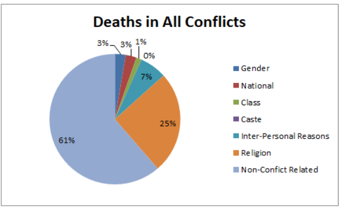

The second graph depicts the vitality status of characters during instances of religious conflicts. We omitted the single instance of birth from the data as it wasn’t relevant to our research question.
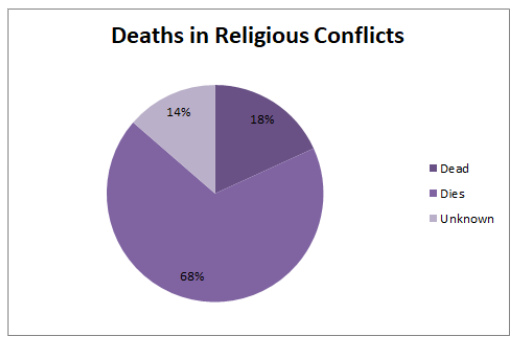

## Religious Conflict and Gender

We used Excel to create the visualization of religious conflict and gender. To showcase the difference between the vitality of different genders in general throughout the database and the vitality of different genders during religious conflicts, we generate two graphs for each case.  
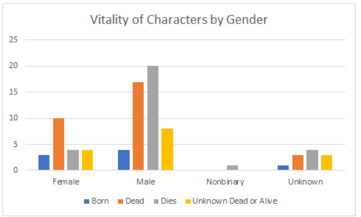
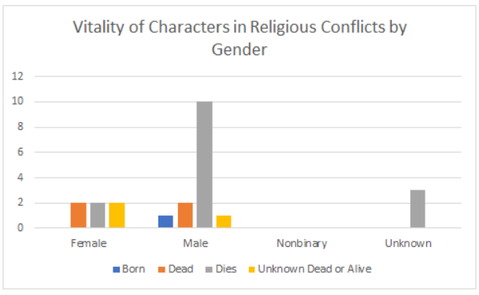

From these two visualizations, we see the changes in vitality for each gender in religious conflicts and in general throughout the partition literature.  

## Locating Religious Conflicts

<iframe src='https://heuristplus.sydney.edu.au/heurist/viewers/map/map_leaflet.php?q=%5B%7B%22t%22%3A%2254%22%7D%2C%7B%22linkedfrom%3A59%3A16%22%3A%5B%7B%22t%22%3A%2259%22%7D%2C%7B%22f%3A4021%22%3A%225581%22%7D%5D%7D%2C%7B%22sortby%22%3A%22t%22%7D%5D&db=partition_literature&editstyle=1&basemap=MapBox.StreetMap&controls=legend%2Cbookmark%2Cgeocoder%2Cselector%2Cprint' width="800" height="650" frameborder="0"></iframe>


As geotags aren’t available for most of the religious conflicts, only a total of 14 locations could be mapped to a geographical location. What is interesting here is the fact that all 14 locations are situated around the Indo-Pak border. While this could just as well be a result of the inconsistency of the data entry, it corresponds with the idea that most religious conflicts took place in and around the Indo-Pak border during partition. 

## Remembering and Narrating Religious Conflicts

## Histogram of the Narrative Status of Religious Conflicts

First, we load and import the required libraries.

```{r important libraries}
library(gutenbergr)
library(dplyr)
library(tidytext)
library(stringr)
library(tidyverse)
library(tm)
library(ggplot2)
library(tidyr)
library(plotly)
library(ggthemes)
library(scales)
```

Next, we import the CSV file containing the required data for the histogram.

```{r importing csv}
narrativestatus_religiousconflict <-
read_csv("csv/narrativestatus_religiousconflicts.csv")
```

Now that we have our data, it's time to create our visualization! We will be using the code created by Alex Polymath (for reference: [https://www.codementor.io/\@alexander-k/r-word-frequency-in-dataframe-165jgfxxqe\#step-1-create-stopwords-dataframe](https://www.codementor.io/@alexander-k/r-word-frequency-in-dataframe-165jgfxxqe#step-1-create-stopwords-dataframe){.uri}).

```{r histogram}
ggplot(narrativestatus_religiousconflict, aes(x = narrative_status, y = religious_conflicts, fill= narrative_status )) + geom_col() 
```

As per our analysis of this query in the previous section, most instances of religious conflicts are narrated, and those which are remembered or told follow after a drastic drop in occurrences in descending order.

## Instances of Mob Violence

First, we import the csv of the crosstabs containing the instances of mob violence
```{r import_datasets}
groups_violence <-
  read_csv("csv/number_violence.csv")
```

Then, we visualize this using ggplot using the code as follows.

```{r}
ggplot(groups_violence, aes(x=Number, y=count, fill=Number)) +  geom_col() 
  
```

It was interesting to view how most instances of violence was inflicted by individuals rather than by groups or mobs, as one would usually think that there were more mob-caused violence during national conflicts like partition. 

# Reflection

While adding events as entries to the database, we had to identify which events played a significant role in pushing along the plot while providing adequate context/setting to the narrative. We also had to refine the main research question after having completed all the analyses in order to ensure that we had answered as many of the questions as possible. Due to this, a lot of preliminary research was conducted before a structured research question could be articulated. 
The original queries we had come up with had to be changed and revised in order to ask questions which were compatible with or corresponded with the crosstabs’ data. The queries also had to be structured in a manner that corresponded with what we were able to produce in visualizations. Further, when creating crosstabs for queries, we ran into a recurring problem. We were limited to using variables only from the same fields, and therefore cross-field variables weren’t a possibility. This restricted us from developing more nuanced data comparisons. This was an obstacle in reaching deeper and more meaningful insights on Heurist itself.
We had to use different means of visualization tools such as Excel, GIS and R to present data from queries in a way that can explain the queries as well as possible. Therefore, one set of tools proved insufficient to generate what we were trying to access. We could not get more consistent results from the visualization of locations because of the lack of geotagged locations when describing religious conflicts. Further, the nature of data entry itself was limiting insofar as some of our questions couldn’t be framed into effective crosstab variables. For example, we had wanted to look into the violence associated with migration during partition, however the data entered never recorded variables to enable further research into the same. 
To conclude, we were bound by limitations vis-a-vis the tools we were given, and were not able to answer more questions that we wanted to explore, such as the kind of violence in movement, mobs inflicting harm on one another, henceforth. The limitations of using variables from only one field also impeded our research, and hence the crosstabs were not the most effective in our attempt to gain more insight into the kinds of violence that emerged from partition. 
=======
---
title: "Project 3 Group 4"
author: " Amola Mehta, Anjali Sajith, Auntora Mitra, Pulari Baskar"
output:
  html_document:
    font_size: 14
    toc: TRUE
    toc_float: TRUE
    toc_depth: 6
    margin-left: auto;
    margin-right: auto;
---


```{r setup, include=FALSE}
knitr::opts_chunk$set(echo = TRUE, message = FALSE)
```


# Complicating Communalism

*Analyzing Instances and Effects of Religious Conflicts in Manto’s “Mottled Dawn” and Sarna’s “Savage Harvest”*

# Introduction and Research Questions

For our project, we decided to perform an analysis of the religious conflicts that take place in Saadat Hasan Manto’s collection of short stories on partition, Mottled Dawn. We procured our data from the collaborative Heurist database the class created for this project. Our group contributed a total of 168 entries to the database. The break-up of the number of entries by each group member is as follows:

Amola Mehta : n=29
Anjali Sajith : n=20
Auntora Mitra : n=78 
Pulari Baskar : n=41

The specific questions we used to frame our research were: 
What are the different effects of the religious conflicts we see recorded in Manto’s, Mottled Dawn and Sarna’s Savage Harvest ? How do instances of religious conflict manifest across the collection? How do these lines of inquiry complicate our understanding of partition via its fictionalization? 

# Research Queries 

In order to help arrive at answers to our research questions, we operationalized five potential lines of inquiry into the following queries:

How many deaths have occurred in religious conflicts? (Filters: Characters in Events, Religious Conflict, Variable 1 = Vitality)

What is the difference in the number of men and women killed in religious conflicts? Does gender based-conflict occur outside of religion? (Filters: Characters in Events, Religious Conflict, Variable 1 = Vitality, Variable 2 = Gender)

Where does most of the religious conflict take place? What is the religious background of the location?  (Filters: Events, Religious Conflict,  Variable 1 = Location of Event)

How do instances of religious conflict occur in the collection? Are they narrated in the present or are they remembered in the past? (Filters: Events, Variable 1 = Narrative Status, Variable 2 = Conflict)

How many events talk about groups of people inflicting violence upon another? (Filters: Character, Variable 1 = Number, Variable 2 = Religion)

# Crosstabs

Using the Crosstabs function provided by Heurist, we generated the following tables as CSV files:


# Analysis

## Deaths in Religious Conflicts

Considering that Mottled Dawn and Savage Harvest are collections of stories surrounding partition, we expected there to be a significant amount of casualties or deaths that were products of religious conflicts and communal turmoil. However, our research showed that there were only 19 deaths (plus three people who are unknown to be dead or alive) in religious conflicts in the entire collection, out of a total of 75 deaths in general. Out of the 19 deaths, four people did not die in the present time of the narratives, but were already dead, while the remaining fifteen died as the story unfolded. We were expecting there to be a more significant number of deaths as a product of religious turmoil given the communalism that fueled the partition of India. Given that only 29% of the deaths in the collection were due to religious conflict, it becomes clear that there were other tensions at play besides communalism around the time of partition. The other deaths that occur as a result of conflicts are of gender (2), in name of the nation (2), inter-personal reasons (5), and one potential death due to a class conflict.  

## Religious Conflicts and Gender

Our research revealed that before the actual partition of India, the number of men and women that died were equal (two each). However, during and after the partition, the balance is no longer maintained as 10 men are killed while only two women are killed in religious conflicts. Based on our reading of the short stories, our understanding is that since more men featured in prominent active roles across the collection, the likelihood of them being killed was higher. Women tended to take up more passive roles in the collection. It is also possible that as Manto and Sarna themselves were men, they may have had a tendency to write stories that revolved more around men than feature women in an active role. Lastly, as violence requires aggression, it is possible that the author associated violent acts with men as they are stereotypically believed to be more brute-like than women. There are however 38 accounts of gender-based violence (including a minimum of 3 rapes) that are perpetrated against women. Thus in the collection men take on the role of both inflicting and receiving facing violence, whereas women remain victims. 

## Locating Religious Conflicts

Bombay recorded the highest number of instances of religious conflict (10) in the collection. The other locations that featured religious conflict were not either not geo-taggable (Rashida’s home in Pinjar, with 12 instances), or were not necessarily significant. It was also interesting to note that there were 9 instances of violence in a Gurudwara from Tamas. Gurudwaras are the place of worship for Sikhs, who weren’t Hindus or Muslims but shared geographical proximity with the partition. Thus, this further affirms that the partition wasn’t merely a Hindu-Muslim conflict, but affected other communities as well, attesting to the religious syncreticism of the event. For instance, there is just one recorded instance of violence in Amritsar from The Assignment. However, we must concede that this data is not necessarily air-tight, as it depends on how each group selected and classified their events from the stories they were assigned.

## Remembering and Narrating Religious Conflicts

Our fourth line of inquiry sought to identify the manner in which religious conflicts occured in the collection- whether they occurred as events taking place in the present time of the narratives or whether they were happenings of the past. The database has recorded 47 instances of religious conflicts that are narrated in the present, 11 which are remembered and seven that are told. The author’s choice of having most instances of religious conflicts as events that happen in the present could possibly have been to create a more powerful impact on the reader, as the present tense carries a sense of immediacy. As the events unfold in relation to characters actively participating in the narrative, it also becomes easier for the reader to relate to or empathize with them, as opposed to the reader receiving the event as the solemn nostalgia of one of the characters. That being said, the act of recollecting memories/stories is significant in relation to acts of violence, as it is a more personal way of learning lessons from history. 

## Instances of Mob Violence 

In order to understand instances of mob violence, we aimed to crosstab conflict counts with counts of each character’s religion. It was found that the highest number of mobs belonged to unknown religions, with a total of 14 counts. Conflict counts also emerged the highest in religious contexts, with a total of 272 instances. However, we were not able to extrapolate much from this given data set, as it does not tell us about certain groups inflicting violence onto other characters/groups. Hence, we present this as a factoid. 

# Visualizations

## Death in Religious Conflicts

To arrive at a visualization to represent both the number of deaths in all conflicts as well as the vitality status of people who died in religious conflicts, we decided to use Microsoft Excel to generate pie charts. We believed that a pie chart was best suited for this data as a bar graph would have produced a rather imbalance graph which wouldn’t have been visually appealing. Additionally, as we already had the actual numerical values of each category of fatality, we wanted to showcase the percentage values of the same. 
The first graph depicts the different types of conflicts in which fatalities had occurred:


The second graph depicts the vitality status of characters during instances of religious conflicts. We omitted the single instance of birth from the data as it wasn’t relevant to our research question.


## Religious Conflict and Gender

We used Excel to create the visualization of religious conflict and gender. To showcase the difference between the vitality of different genders in general throughout the database and the vitality of different genders during religious conflicts, we generate two graphs for each case.  


From these two visualizations, we see the changes in vitality for each gender in religious conflicts and in general throughout the partition literature.  

## Locating Religious Conflicts

<iframe src='https://heuristplus.sydney.edu.au/heurist/viewers/map/map_leaflet.php?q=%5B%7B%22t%22%3A%2254%22%7D%2C%7B%22linkedfrom%3A59%3A16%22%3A%5B%7B%22t%22%3A%2259%22%7D%2C%7B%22f%3A4021%22%3A%225581%22%7D%5D%7D%2C%7B%22sortby%22%3A%22t%22%7D%5D&db=partition_literature&editstyle=1&basemap=MapBox.StreetMap&controls=legend%2Cbookmark%2Cgeocoder%2Cselector%2Cprint' width="800" height="650" frameborder="0"></iframe>


As geotags aren’t available for most of the religious conflicts, only a total of 14 locations could be mapped to a geographical location. What is interesting here is the fact that all 14 locations are situated around the Indo-Pak border. While this could just as well be a result of the inconsistency of the data entry, it corresponds with the idea that most religious conflicts took place in and around the Indo-Pak border during partition. 

## Remembering and Narrating Religious Conflicts

## Histogram of the Narrative Status of Religious Conflicts

First, we load and import the required libraries.

```{r important libraries}
library(gutenbergr)
library(dplyr)
library(tidytext)
library(stringr)
library(tidyverse)
library(tm)
library(ggplot2)
library(tidyr)
library(plotly)
library(ggthemes)
library(scales)
```

Next, we import the CSV file containing the required data for the histogram.

```{r importing csv}
narrativestatus_religiousconflict <-
read_csv("csv/narrativestatus_religiousconflicts.csv")
```

Now that we have our data, it's time to create our visualization! We will be using the code created by Alex Polymath (for reference: [https://www.codementor.io/\@alexander-k/r-word-frequency-in-dataframe-165jgfxxqe\#step-1-create-stopwords-dataframe](https://www.codementor.io/@alexander-k/r-word-frequency-in-dataframe-165jgfxxqe#step-1-create-stopwords-dataframe){.uri}).

```{r histogram}
ggplot(narrativestatus_religiousconflict, aes(x = narrative_status, y = religious_conflicts, fill= narrative_status )) + geom_col() 
```

As per our analysis of this query in the previous section, most instances of religious conflicts are narrated, and those which are remembered or told follow after a drastic drop in occurrences in descending order.

## Instances of Mob Violence

First, we import the csv of the crosstabs containing the instances of mob violence
```{r import_datasets}
groups_violence <-
  read_csv("csv/number_violence.csv")
```

Then, we visualize this using ggplot using the code as follows.

```{r}
ggplot(groups_violence, aes(x=Number, y=count, fill=Number)) +  geom_col() 
  
```

It was interesting to view how most instances of violence was inflicted by individuals rather than by groups or mobs, as one would usually think that there were more mob-caused violence during national conflicts like partition. 

# Reflection

While adding events as entries to the database, we had to identify which events played a significant role in pushing along the plot while providing adequate context/setting to the narrative. We also had to refine the main research question after having completed all the analyses in order to ensure that we had answered as many of the questions as possible. Due to this, a lot of preliminary research was conducted before a structured research question could be articulated. 
The original queries we had come up with had to be changed and revised in order to ask questions which were compatible with or corresponded with the crosstabs’ data. The queries also had to be structured in a manner that corresponded with what we were able to produce in visualizations. Further, when creating crosstabs for queries, we ran into a recurring problem. We were limited to using variables only from the same fields, and therefore cross-field variables weren’t a possibility. This restricted us from developing more nuanced data comparisons. This was an obstacle in reaching deeper and more meaningful insights on Heurist itself.
We had to use different means of visualization tools such as Excel, GIS and R to present data from queries in a way that can explain the queries as well as possible. Therefore, one set of tools proved insufficient to generate what we were trying to access. We could not get more consistent results from the visualization of locations because of the lack of geotagged locations when describing religious conflicts. Further, the nature of data entry itself was limiting insofar as some of our questions couldn’t be framed into effective crosstab variables. For example, we had wanted to look into the violence associated with migration during partition, however the data entered never recorded variables to enable further research into the same. 
To conclude, we were bound by limitations vis-a-vis the tools we were given, and were not able to answer more questions that we wanted to explore, such as the kind of violence in movement, mobs inflicting harm on one another, henceforth. The limitations of using variables from only one field also impeded our research, and hence the crosstabs were not the most effective in our attempt to gain more insight into the kinds of violence that emerged from partition. 
>>>>>>> 6253c9022cd3396d859dfc0b58f23768f2c539bf:index.Rmd
